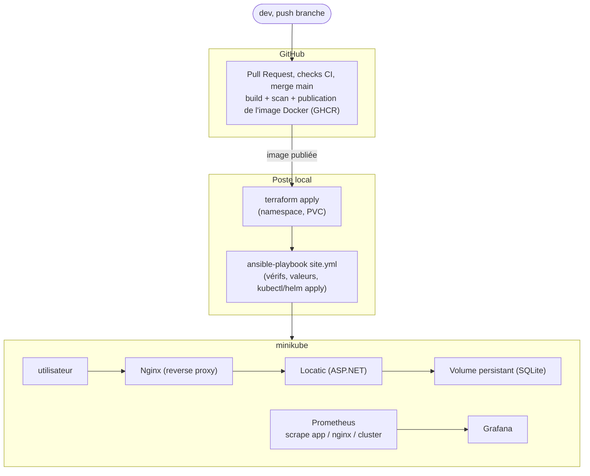

# Architecture

## Schéma d'ensemble

GitHub gère le code et publie l'image, mais ne déploie rien. Le déploiement se fait depuis mon poste, sur minikube, avec Terraform puis Ansible.

## Rôle de chaque brique

### GitHub Actions s'arrête après avoir publié l'image

Le sujet interdit tout VPS ou serveur distant. Les runners GitHub tournent dans le cloud et ne peuvent pas atteindre mon réseau local, donc déployer sur minikube depuis GitHub Actions est impossible sans exposer ma machine sur internet. Le pipeline s'arrête donc après la publication de l'image sur la registry (voir [ci-cd.md](ci-cd.md)).

### Terraform prépare le strict nécessaire

Terraform crée uniquement le namespace Kubernetes et le volume persistant (PVC) pour SQLite. Le sujet demande que Terraform *prépare* l'infrastructure et qu'Ansible s'occupe du *déploiement*. Ça évite aussi qu'un `terraform apply` redémarre l'application à chaque fois : le namespace et le volume changent rarement, l'application change à chaque image. Détails dans [terraform.md](terraform.md).

### Ansible fait le travail répétitif

C'est ce que je lance à chaque déploiement : il vérifie que minikube tourne, récupère les outputs Terraform (namespace, nom du volume), et applique les ressources Kubernetes de l'application et de Nginx. Voir [ansible.md](ansible.md).

### Nginx est le seul point d'entrée

Contrainte du sujet : l'application ne doit jamais être exposée directement. Le Service Kubernetes de Locatic est en `ClusterIP` (injoignable de l'extérieur), seul le Service Nginx est en `NodePort`. Nginx expose aussi des métriques pour le monitoring.

### SQLite avec un volume persistant

L'application n'a pas de base externe : toutes les données vivent dans un fichier SQLite dont le chemin est lu depuis `DB_PATH`, qui pointe vers le PVC créé par Terraform. Les données survivent à la suppression du pod (testé, voir [exploitation.md](exploitation.md)).

Conséquence à laquelle je n'avais pas pensé au départ : SQLite ne supporte pas plusieurs écrivains simultanés. Un seul replica (`replicas: 1`), sinon deux pods pourraient corrompre la base.

### Le monitoring surveille chaque brique

Prometheus récupère les métriques de l'application (`/metrics`), de Nginx et du cluster. Grafana affiche tout dans un dashboard. Voir [monitoring.md](monitoring.md).

## Choix à justifier

| Choix | Pourquoi |
|-------|---------|
| GHCR comme registry | Intégrée à GitHub, authentification via `GITHUB_TOKEN` auto, pas de secret externe à créer |
| Pipeline en plusieurs jobs (`test`, `build-app`, `build-image`, `security`...) | Chaque job a un rôle précis, on voit tout de suite laquelle des étapes a échoué |
| Terraform limité au namespace + stockage | Sépare l'infra durable de l'app qui change à chaque déploiement |
| Nginx en Deployment + ConfigMap plutôt qu'Ingress | Config explicite et versionnée, Nginx monitoré comme les autres services |
| `DB_PATH` en variable d'environnement | Même binaire en dev, tests et prod, seul le chemin change |
