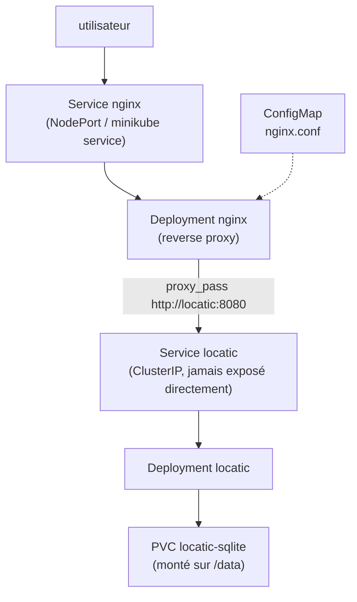

# Kubernetes

## Circulation du trafic



Une requête utilisateur arrive toujours sur Nginx en premier, jamais directement sur l'application.

Les manifests sont des templates Jinja2 (`.j2`), un dossier `templates/` par rôle Ansible (`infra/ansible/roles/base/templates/` pour l'app, `infra/ansible/roles/nginx/templates/` pour Nginx), remplis au moment du déploiement. Ça permet de changer image, tag, replicas, variables d'environnement, type d'exposition et chemin SQLite sans dupliquer à la main les valeurs venant de Terraform (namespace, PVC). Détail de l'exécution dans [ansible.md](ansible.md), namespace/PVC créés en amont par [terraform.md](terraform.md).

## Deployment de l'application (`roles/base/templates/app-deployment.yaml.j2`)

```yaml
apiVersion: apps/v1
kind: Deployment
metadata:
  name: locatic
  labels: { app: locatic }
spec:
  replicas: {{ app_replicas }}        # 1 : SQLite = un seul écrivain
  strategy:
    type: Recreate                    # évite 2 pods écrivant le même fichier SQLite
  selector:
    matchLabels: { app: locatic }
  template:
    metadata:
      labels: { app: locatic }
      annotations:                    # découverte par Prometheus
        prometheus.io/scrape: "true"
        prometheus.io/port: "8080"
        prometheus.io/path: /metrics
    spec:
      securityContext:
        runAsNonRoot: true
      containers:
        - name: locatic
          image: "{{ app_image }}:{{ app_tag }}"
          ports: [{ containerPort: 8080 }]
          env:
            - name: DB_PATH
              value: /data/locatic.db
            - name: ASPNETCORE_ENVIRONMENT
              value: Production
          volumeMounts:
            - name: sqlite-data
              mountPath: /data
          livenessProbe:              # le conteneur répond-il encore ?
            httpGet: { path: /health, port: 8080 }
            initialDelaySeconds: 10
            periodSeconds: 15
          readinessProbe:             # prêt à recevoir du trafic (DB accessible) ?
            httpGet: { path: /health, port: 8080 }
            initialDelaySeconds: 5
            periodSeconds: 10
          resources:
            requests: { cpu: 100m, memory: 128Mi }
            limits:   { cpu: 500m, memory: 256Mi }
      volumes:
        - name: sqlite-data
          persistentVolumeClaim:
            claimName: "{{ sqlite_pvc }}"
```

Quelques choix : `strategy: Recreate` au lieu de `RollingUpdate` par défaut, lié à la contrainte SQLite (un RollingUpdate ferait coexister brièvement deux pods sur le même fichier, risque de corruption). J'accepte une courte coupure à chaque déploiement plutôt que ce risque. Les probes pointent vers `/health`, qui vérifie aussi l'accès à la base : si le volume a un problème, le pod sort du Service et redémarre. `DB_PATH=/data/locatic.db` pointe vers le PVC créé par Terraform, les données survivent aux redémarrages (vérifié, voir [exploitation.md](exploitation.md)).

## Service de l'application (`roles/base/templates/app-service.yaml.j2`)

```yaml
apiVersion: v1
kind: Service
metadata:
  name: locatic
spec:
  type: ClusterIP          # interne uniquement : l'app n'est PAS le point d'entrée
  selector: { app: locatic }
  ports: [{ port: 8080, targetPort: 8080 }]
```

`type: ClusterIP` garantit que l'application n'est jamais accessible directement depuis l'extérieur du cluster.

## Nginx en reverse proxy

Fichiers dans `infra/ansible/roles/nginx/templates/`.

`nginx-configmap.yaml.j2` :

```yaml
apiVersion: v1
kind: ConfigMap
metadata:
  name: nginx-conf
data:
  default.conf: |
    server {
      listen 80;

      location /stub_status {        # métriques pour l'exporter Prometheus
        stub_status;
        allow 127.0.0.1;
        deny all;
      }

      location / {
        proxy_pass http://locatic:8080;
        proxy_set_header Host $host;
        proxy_set_header X-Real-IP $remote_addr;
        proxy_set_header X-Forwarded-For $proxy_add_x_forwarded_for;
        proxy_set_header X-Forwarded-Proto $scheme;
      }
    }
```

`nginx-deployment.yaml.j2` fait tourner Nginx avec un sidecar dédié à Prometheus :

```yaml
apiVersion: apps/v1
kind: Deployment
metadata:
  name: nginx
  labels: { app: nginx }
spec:
  replicas: 1
  selector:
    matchLabels: { app: nginx }
  template:
    metadata:
      labels: { app: nginx }
      annotations:
        prometheus.io/scrape: "true"
        prometheus.io/port: "9113"
    spec:
      containers:
        - name: nginx
          image: nginx:1.27-alpine
          ports: [{ containerPort: 80 }]
          volumeMounts:
            - name: conf
              mountPath: /etc/nginx/conf.d
          readinessProbe:
            httpGet: { path: /stub_status, port: 80 }
          resources:
            requests: { cpu: 50m, memory: 32Mi }
            limits:   { cpu: 200m, memory: 64Mi }
        - name: nginx-exporter          # traduit stub_status en métriques Prometheus
          image: nginx/nginx-prometheus-exporter:1.4
          args: ["--nginx.scrape-uri=http://127.0.0.1/stub_status"]
          ports: [{ containerPort: 9113 }]
      volumes:
        - name: conf
          configMap: { name: nginx-conf }
```

Nginx expose une page de stats (`stub_status`) mais pas au format Prometheus. Le conteneur `nginx-exporter`, dans le même pod, fait la traduction sur le port 9113.

`nginx-service.yaml.j2`, le seul point d'entrée utilisateur :

```yaml
apiVersion: v1
kind: Service
metadata:
  name: nginx
spec:
  type: {{ nginx_service_type }}   # NodePort par défaut, voir roles/nginx/defaults/main.yml
  selector: { app: nginx }
  ports: [{ port: 80, targetPort: 80 }]
```

## Les secrets

L'application n'a besoin d'aucun secret pour l'instant (pas de base externe, pas d'API tierce). Si un secret devenait nécessaire : versionner uniquement un template (`app-secret.template.yaml`) avec des placeholders, et laisser Ansible injecter les vraies valeurs depuis des variables locales non versionnées.

## Vérification

```bash
minikube service nginx -n locatic --url   # URL du point d'entrée
kubectl get all -n locatic
kubectl get pvc -n locatic

# Pour prouver que l'app n'est pas exposée directement :
kubectl get svc -n locatic    # locatic = ClusterIP (pas de port externe), nginx = NodePort
```

Détail complet des vérifications post-déploiement dans [exploitation.md](exploitation.md).
